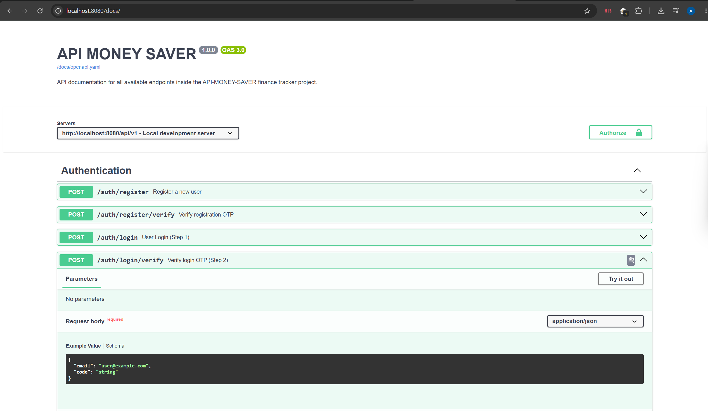

# 💰 API Money Saver - Backend SaaS

Aplikasi backend REST API untuk manajemen keuangan personal yang terintegrasi dengan Telegram Bot, OCR Receipt Scanner, dan Email Parsing.

---

## 🚀 Panduan Instalasi & Menjalankan Proyek (Setup Guide)

Ikuti urutan langkah di bawah ini untuk mendirikan dan menjalankan aplikasi di lingkungan lokal.

### 1. Clone Repository

Silakan *clone repository* ini dan masuk ke dalam direktori utama proyek:

```bash
git clone https://github.com/Azmi117/API-MONEY-SAVER.git
cd API-MONEY-SAVER
```

### 2. Instalasi Package / Dependensi

Gunakan perintah:

```bash
go mod tidy
```

### 3. Setup Environment Variables (.env)

Duplikat file template `.env.example` menjadi file `.env`:

**Linux / Mac / Git Bash**
```bash
cp .env.example .env
```

**Windows (PowerShell)**
```powershell
Copy-Item .env.example -Destination .env
```

Buka file `.env` lalu sesuaikan seluruh konfigurasi seperti kredensial database, API key, token Telegram, dan kebutuhan lokal lainnya.

### 4. Setup Database & Migrasi

Sebelum menjalankan migrasi, buat database PostgreSQL terlebih dahulu.

Buka PostgreSQL (pgAdmin, DBeaver, atau terminal `psql`) lalu jalankan:

```sql
CREATE DATABASE api_money_saver;
```

> Sesuaikan nama database dengan nilai `DB_NAME` pada file `.env`.

Setelah database berhasil dibuat, jalankan migrasi:

```bash
go run cmd/migrate/main.go
```

### 5. Install Air (Hot Reload)

Install Air secara global (jika belum terpasang):

```bash
go install github.com/air-verse/air@latest
```

Setelah selesai, jalankan:

```bash
air
```

### 6. API Documentation

Proyek ini sudah dilengkapi dengan dokumentasi API interaktif yang tertanam langsung di dalam server backend.


1. Pastikan server aplikasi sudah berjalan (`go run` atau `air`).
2. Buka browser dan akses:

```text
http://localhost:8080/docs/
```
